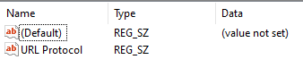
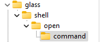

# How to Setup Registry Stuff
This doc outlines how to setup the registry stuff necessary to allow a custom URI to run the python code. This allows for the file to be run anywhere, from the search bar of a browser, within Obsidian or with the run Dialouge in Windows.

## Steps:
#### Open registry editor
Use the windows menu to search to open the registry editor. It's the one that asks for admin privileges and has the funky blue logo. Try and avoid messing about with it too much, as I'm pretty sure it can brick your computer if you use it wrong enough.

#### Make a new Key
Right click on the `HKEY_CLASSES_ROOT` folder, and then select `New/Key`. Give the key the name you want the URL to be. For consistency, I'm gonna use `glass`. 

#### Make value
Once you have made the key, you should see the main pane of Registry Editor populated with a key with the Name `default` and `(value not set)` in the Data column. Right click below this and select `New/String Value`. For this string value, the value name is `URL Protocol`, and the value is to be left empty. 



#### Make Sub-keys
Then go back to the left-hand file pane. Right click on the key you made (called `glass`), and then select `New/Key` again. Name this key `shell`. Repeat this process on shell, and name the sub-key `open`. Repeat thise once more on open, naming the subkey `command`.



#### Funky command stuff
Once you have opened the `command` key, change the value of the default key to the following:

```
"{PATH TO BAT FILE}" \"%1\""
```

Note that the `"` are necessary, and the `{` is to be deleted. Where:
- `{PATH TO BAT FILE}` is the path to the `idOpener.bat` file

You must include the `"%1"` to allow the arguments of the URI to be passed to the Python File. 


## Using the URI
You can then type `glass://00.01` into a browser or Obsidian Link to bring up this setup documentation. 